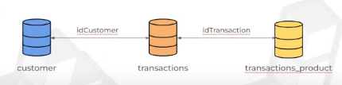

# Project-DataScience-Aumentando-Engajamento-

A ideia desse projeto é aumentar o engajamento de um canal na Twitch. Para isso, vamos utilizar o banco de dados database.db, esse banco de dados tem tres tabelas (customer, transactions e trannsctions_product), que segue o seguinte modelo:

